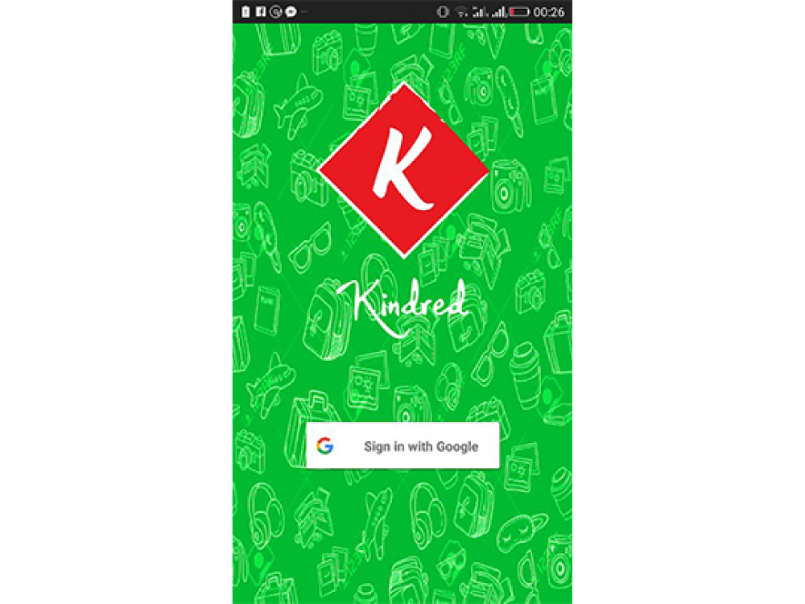
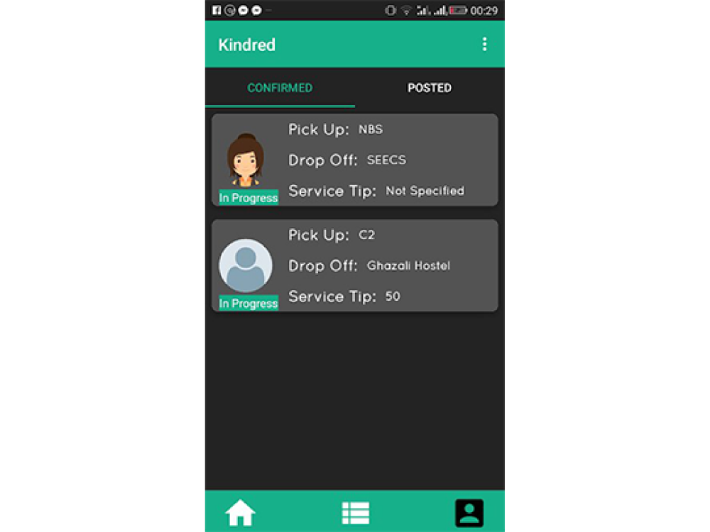
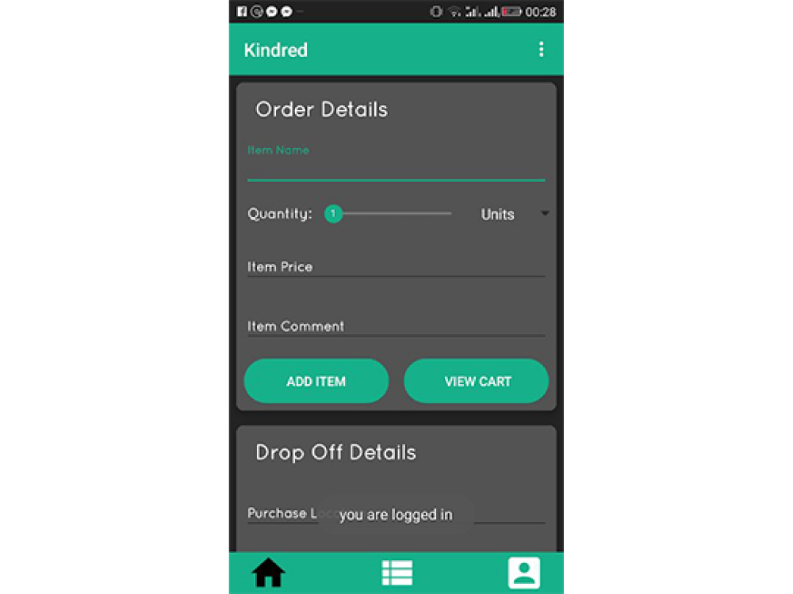

# Kindred App

A one-of-a-kind delivery service platform initiated with the objective of igniting the collaborative spirit to advance a sense of community.

<!-- Developed by students, for students. -->

## Key Features

- Post orders and check their status.
- Propose a commission
- Chat with those who confirmed your order.
- Accept those orders you want to deliver.
- Upload your photo and set up a profile.

## Links

[https://github.com/AdnanIqbalKhan/Kindred](https://github.com/AdnanIqbalKhan/Kindred)
https://play.google.com/store/apps/details?id=com.kindred.kindred

## Technologies used

- Java
- Firebase
- Android Studio

### App Features

- Social Media Account Integration
- Location-Based Service
- Chat & Messaging Software
- Camera
- Review or Feedback Collection
- User Profile Creation
- User Authentication

### Devices

- Smartphone

### Mobile Platforms

- Android

### Mobile Programming Languages

- Java

## Login Screen

## Orders List

## Place Order

