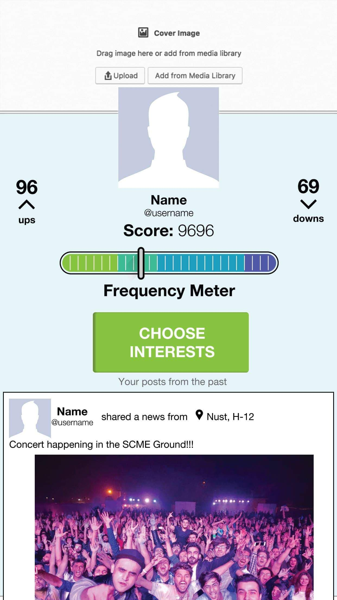
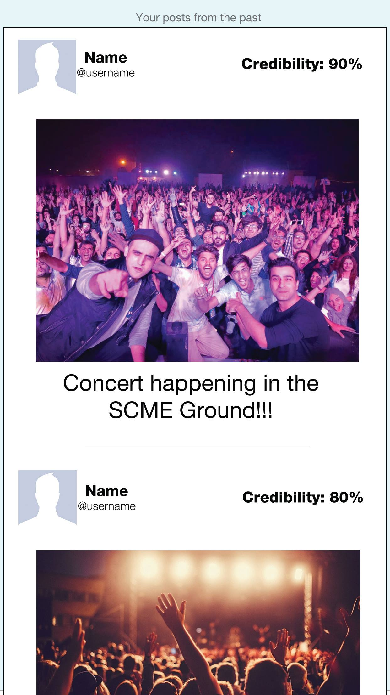
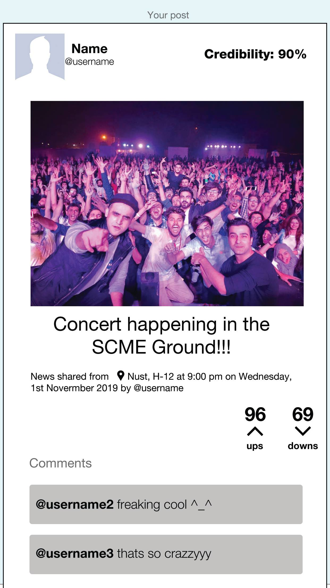
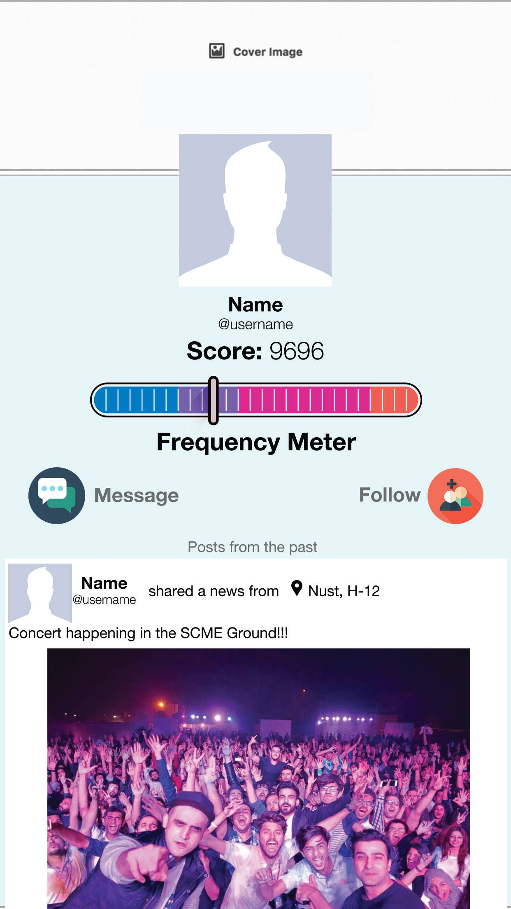

# The News App

Get latest news of your locality

<!-- Developed by students, for students. -->

## Technologies used

- Java
- Firebase
- Android Studio

<!-- ### App Features -->
<!--
- Social Media Account Integration
- Location-Based Service
- Chat & Messaging Software
- Camera
- Review or Feedback Collection
- User Profile Creation
- User Authentication -->

### Devices

- Smartphone

### Mobile Platforms

- Android

### Mobile Programming Languages

- Java

## Start Screen

## Register Screen

## Interest Screen

## Profile Screen

## Post List

## Single Post

## User Profile

